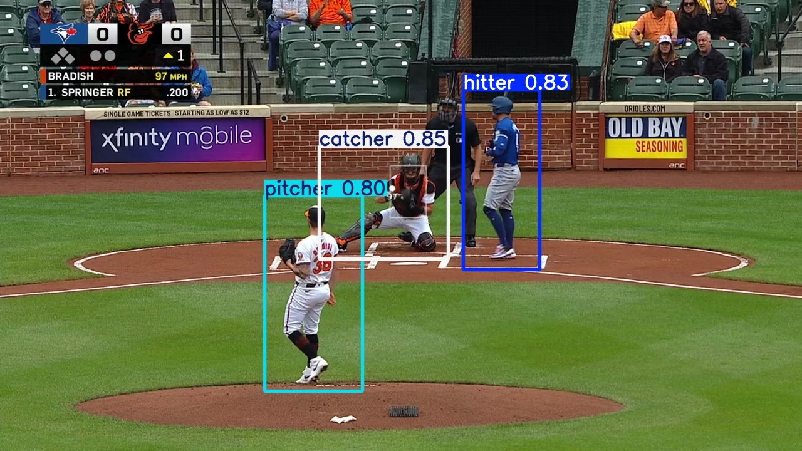

# BaseballCV

[](https://github.com/dylandru/BaseballCV/actions/workflows/pytest.yml)
[](https://github.com/dylandru/BaseballCV/actions/workflows/build.yml)
[](https://codecov.io/github/dylandru/BaseballCV)

**Created By: Dylan Drummey ([@drummeydylan](https://x.com/DrummeyDylan)) and Carlos Marcano ([@camarcano](https://x.com/camarcano))  
Maintained By: Carlos Marcano**


 **A collection of tools and models designed to aid in the use of Computer Vision in baseball.**

## Goals

Our goal is to provide access to high-quality datasets and computer vision models for baseball. By sharing our annotated data and model weights, we hope to foster innovation in sports analytics and make it easier for developers to create tools that analyze baseball games.

## Installation and Setup

To get started with our datasets and models, follow these steps:

### Install Package

The package can be installed from Github with the required dependencies using the following command:

```bash
pip install git+https://github.com/dylandru/BaseballCV.git
```

### Clone the Repository Locally

The repository can be cloned from Github with the required dependencies installed using the following commands:

```bash
git clone https://github.com/dylandru/BaseballCV.git
cd BaseballCV
pip install -r requirements.txt
```
### Important Reminders

- Imports vary from using package to using local files; every import from the package is prefixed with `baseballcv.`
- The package is currently in development and may not be fully functional. 
- The package is not yet available on PyPI, so it must be installed from Github.

## Available Assets

### 1. Datasets
We provide open-source datasets containing images and corresponding annotations from baseball broadcasts and other video sources. These datasets are curated and annotated with bounding boxes and labels for various baseball objects. These datasets are designed to detect:

- Pitchers
- Hitters
- Catchers
- Baseball
- Pitcher's Glove
- Bat
- Other objects of interest

Datasets are available in common formats like YOLO, allowing for easy integration with computer vision pipelines. Our current datasets include:

**Available YOLO Pre-Annotated Datasets**:

- `baseball_rubber_home_glove.txt`: A comprehensive MLB broadcast-based YOLO-format annotated dataset with annotations for baseballs, the rubber, homeplate, and the catcher's mitt.
- `baseball_rubber_home.txt`: An MLB broadcast-based YOLO-format annotated dataset with annotations for baseballs, the rubber, and the catcher's mitt.
- `baseball.txt`: An MLB broadcast-based YOLO-format annotated dataset with annotations for solely baseballs.

**Available Raw Photos Datasets**: 

- `broadcast_10k_frames.txt`: A collection of 10,000 unannotated MLB broadcast images that can be used for creating custom datasets or annotations.
- `broadcast_15k_frames.txt`: A collection of 15,000 unannotated MLB broadcast images that can be used for creating custom datasets or annotations.

**Available COCO-format Datasets**:
- `baseball_rubber_home_COCO.txt`: A comprehensive MLB broadcast-based COCO-format annotated dataset with annotations for baseballs, the rubber, and homeplate.
- `baseball_rubber_home_glove_COCO.txt`: A comprehensive MLB broadcast-based COCO-format annotated dataset with annotations for baseballs, the rubber, homeplate, and the catcher's mitt.

**Downloading Datasets**

If you are interested in training your own models with our datasets, you can download the one of the pre-annotated datasets. To download the datasets into a folder, you can use the following:

```python
  from baseballcv.functions import LoadTools

  # Initialize LoadTools class
  load_tools = LoadTools()

  # Download images, .txt file annotations and .yaml file into folder using .txt file path
  dataset_path = load_tools.load_dataset("datasets/yolo/baseball_rubber_home_glove.txt")
  
  # Download images, .txt file annotations and .yaml file into folder using alias
  dataset_path = load_tools.load_dataset("baseball_rubber_home_glove")

```
If you are interested in annotating your own dataset, you can use one of the raw photos datasets. To download the raw photos datasets into a folder prefaced with `unlabeled_`, you can use the following:

```python
  from baseballcv.functions import LoadTools

  # Initialize LoadTools class
  load_tools = LoadTools()

  # Download images into unlabeled_ folder using .txt file path
  dataset_path = load_tools.load_dataset("datasets/raw_photos/broadcast_10k_frames.txt")

  # Download images into unlabeled_ folder using alias
  dataset_path = load_tools.load_dataset("broadcast_10k_frames")
```

**Creating Your Own Datasets**

If you are interested in creating your own datasets from scratch, you can use our tools to help you, such as our photo generator.

```python
  from baseballcv.functions import DataTools

  # Initialize DataTools class
  data_tools = DataTools()

  # Generate 10,000 photos into photos folder from across Savant videos between May 1, 2024 and July 31, 2024
  data_tools.generate_photo_dataset(max_plays=5000, output_frames_folder="photos", max_num_frames=10000, max_videos_per_game=10, start_date="2024-05-01", end_date="2024-07-31", delete_savant_videos=True)
```

With that given dataset, you can then use our automatic annotation tool to annotate the dataset based on an existing model.

```python
  from baseballcv.functions import DataTools

  # Initialize DataTools class
  data_tools = DataTools()

  # Annotate photos folder based on glove tracking model with a confidence threshold of 60%
  data_tools.automated_annotation(model_alias="glove_tracking", dataset_path="photos", conf=0.6)
```

More datasets and tools will likely be added in the future, so check back!

### 2. Pre-trained Models
We offer pre-trained YOLO models for object detection. The models are trained to detect the aforementioned objects with high accuracy.

**Available YOLO Models**:

- `bat_tracking.pt`: Trained to detect bat movement from a broadcast feed
- `ball_tracking.pt`: Trained to detect the baseball from the pitcher's hand to home from a broadcast feed.
- `pitcher_hitter_catcher.pt`: Trained to detect the pitcher, hitter and catcher from a broadcast feed.
- `glove_tracking.pt`: Trained to detect and track the catcher's glove, the ball, homeplate, and the pitcher's rubber from a broadcast feed.
- `ball_trackingv4`: Trained to track ONLY the baseball from pitcher's hand to home plate.

**Available Florence2 Models**:

- `florence_ball_tracking`: Trained to track the baseball from pitcher's hand to home plate among other VLM tasks.

**Available PaliGemma2 Models**:

- `paligemma2_ball_tracking`: Trained to track the baseball from pitcher's hand to home plate among other VLM tasks.

**Available DETR Models**:

- Coming Soon...

## Downloading and Loading Models

### Overview
The `LoadTools` class provides a convenient way to download and load different types of models, including YOLO and Florence2 models. This class handles the downloading of model weights and datasets from either the BallDataLab API or specified text files.

### Loading Models

#### YOLO Models
To load a YOLO model, you can use the `load_model` method of the `LoadTools` class. Below is an example of how to load a YOLO model:

```python
from baseballcv.functions import LoadTools

# Initialize LoadTools class
load_tools = LoadTools()

# Load YOLO model using alias
model_path = load_tools.load_model("bat_trackingv4")

# Load YOLO model using .txt file path
model_path = load_tools.load_model("models/YOLO/bat_tracking/model_weights/bat_tracking.txt")
```

#### Florence 2 Models

To load a Florence 2 model, you can also use the load_model method of the LoadTools class. Below is an example of how to load a Florence 2 model:


```python
from baseballcv.functions import LoadTools

# Initialize LoadTools class
load_tools = LoadTools()

# Load Florence2 model using alias
model_path = load_tools.load_model("florence_ball_tracking", model_type='FLORENCE2')

# Load Florence2 model using .txt file path
model_path = load_tools.load_model("models/vlm/FLORENCE2/ball_tracking/model_weights/florence_ball_tracking.txt", model_type='FLORENCE2')
```

#### PaliGemma 2 Models

To load a PaliGemma 2 model, you can also use the load_model method of the LoadTools class. Below is an example of how to load a PaliGemma 2 model:


```python
from baseballcv.functions import LoadTools

# Initialize LoadTools class
load_tools = LoadTools()

# Load Florence2 model using alias
model_path = load_tools.load_model("paligemma2_ball_tracking", model_type='PALIGEMMA2')

# Load Florence2 model using .txt file path
model_path = load_tools.load_model("models/vlm/paligemma2/ball_tracking/model_weights/paligemma2_ball_tracking.txt", model_type='PALIGEMMA2')
```

## Examples

Below are some examples showcasing our models in action. These include both image and video examples where the models detect various objects within a baseball broadcast.

### Image Example



The above image demonstrates our YOLO model detecting a pitcher, hitter, and catcher during a game broadcast.

### Video Examples

https://github.com/user-attachments/assets/7f56df7e-2bdb-4057-a1d7-d4d50d81708e

https://github.com/user-attachments/assets/fa104a6d-ac26-460c-b096-7f20e2821c20

https://github.com/user-attachments/assets/962973c8-514b-4f39-ac02-ca9f82bf2b59

These videos showcase our models' ability to track multiple objects, including the ball, glove, and other elements in real-time.

## Example Code

### YOLO Models

#### Inference Example

Here's an example of how to use our pre-trained YOLO models to run inference on an image or video.

```python
from ultralytics import YOLO

# Assuming model is already downloaded from .txt file 
model = YOLO("models/ball_tracking/model_weights/ball_tracking.pt")

# Run inference on image
model.predict("example_baseball_broadcast.jpg", show=True)

# Run inference on video
model.predict("assets/example_broadcast_video.mp4", show=True)
```

#### Extraction Example

```python
from ultralytics import YOLO

model = YOLO("models/ball_tracking/model_weights/ball_tracking.pt")

# assign inference on video to results
results = model.predict("assets/example_broadcast_video.mp4", show=True)


for r in results: #loop through each frame
  for box in r.boxes.cpu().numpy(): #loop through each box in each frame
    print(f"XYXY: {box.xyxy}") #print xyxy coordinates of the box
    print(f"XYWHN (Normalized XYWH): {box.xywh}") #print xywh coordinates of the box
    print(f"XYXYN (Normalized XYXY): {box.xyxyn}") #print normalized xyxy coordinates of the box
    print(f"Confidence: {box.conf}") #print confidence of the box
    print(f"Track ID: {box.id}") #print track id of the box (may not exist)
    print(f"Class Value: {box.cls}") #print class value of the box
```

### Florence 2 Models

#### Inference Example

Here's an example of how to use our pre-trained Florence 2 models to run inference on an image. The Florence 2 model supports multiple vision tasks including object detection, image captioning, and open vocabulary detection.

```python
from baseballcv.models import Florence2

# Initialize our Florence 2 model - automatically selects the best available device (CUDA, MPS, or CPU)
model = Florence2()

# Run object detection
detection_results = model.inference(
    image_path='baseball_game.jpg', 
    task='<OD>' 
)

# Run detailed captioning
caption_results = model.inference(
    image_path='baseball_game.jpg',
    task='<DETAILED_CAPTION>'  
)

# Run open vocabulary detection
specific_objects = model.inference(
    image_path='baseball_game.jpg',
    task='<OPEN_VOCABULARY_DETECTION>',
    text_input='Find the baseball, pitcher, and catcher' 
)
```

#### Extraction Example

Here's an example of how to use our pre-trained Florence 2 models to extract predictions from an image. This example shows how to fine-tune the model on your own dataset and extract custom predictions.

```python
from baseballcv.models import Florence2

# Initialize the model for training
model = Florence2()

# Run inference with model
results = model.inference(
    image_path='new_baseball_image.jpg',
    task='<OD>'  # Use object detection to find the players
)

print(results)  #Prints coordinates of BBoxes in JSON as such: {'OD': {'bboxes': [[x1, y1, x2, y2], [x1, y1, x2, y2], ...], 'labels': ['label1', 'label2', ...]}}

```

## Notebooks

Along with our datasets and models, we have provided a few notebooks to help you get started with our repo. These are designed to help you understand the application of our models to real-world baseball videos, which are all accessible in the `notebooks` folder.

- `ball_inference_YOLOv9.ipynb`: A notebook to get you started with our ball tracking model.
- `Glove_tracking.ipynb`: A notebook to get you started with our glove tracking model and extracting predictions.
- `YOLO_PHC_detection_extraction.ipynb`: A notebook to get you started with our pitcher, hitter, catcher detection model along with utilizing these predictions.
- `okd_nokd_classifier.ipynb`: A notebook to get you started with our OKD_NOKD dataset.
- `glove_framing_tracking.ipynb`: A notebook to get you started with our glove tracking model which also transposes the predictions to a 2D plane, while also extracting the predictions.
- `autolabeling_semisupervised.ipynb`: A notebook that shows how to create a base dataset of raw images, auto annotate it and then view the results for manual filtering.

## Streamlit Applications

BaseballCV provides Streamlit-based web apps for interacting with our computer vision models and tools:

### Annotation App

Located in: `/streamlit/annotation_app/`

A web interface for managing and annotating baseball images/videos:
- Open-source project designed to crowdsource baseball annotations
- Upload baseball videos or photos to annotate
- Annotation interface for labeling objects and keypoints
- Integration with AWS S3 for data / photo storage
- Built-in BaseballCV models for predicted annotations

Quick start:
```bash
cd BaseballCV/streamlit/annotation_app/
docker-compose up -d
```

Visit the folder's README for setup and usage instructions.

### Future Streamlit Apps Available Soon

We are currently looking to expand our Streamlit app library, and are open to suggestions and contributions (please consult our contributing guidelines beforehand below).

## Contributing

We welcome contributions from the community! Whether you're looking to improve our datasets, train better models, or build new tools on top of our work, feel free to open a pull request or start a discussion.

### How to Contribute (for repository maintainers)

If you are interested in helping maintain or adding to the repository, please follow these steps:

 - Fork the repository
 - Create a new branch (git checkout -b feature/YourFeature)
 - Commit your changes (git commit -m 'Add YourFeature')
 - Push to the branch (git push origin feature/YourFeature)
 - Open a pull request

### How to Contribute (for supporters)

Our main need is for data annotation. With our new annotation app, you can help us annotate certain datasets. To do so, please follow these steps:

 - Go to the App: [Annotation App](https://balldatalab.com/streamlit/baseballcv_annotation_app/)
 - Enter a Username and Email
 - Open Existing Project
 - Select a Dataset (as of right now, we need with with `player_detection`)) 
 - Open the Annotation Interface and begin annotating!

## Component Status

[](https://github.com/dylandru/baseballcv/actions/workflows/pytest.yml)
[](https://github.com/dylandru/baseballcv/actions/workflows/pytest.yml)
[](https://github.com/dylandru/baseballcv/actions/workflows/pytest.yml)
[](https://github.com/dylandru/baseballcv/actions/workflows/pytest.yml)

## License

This project is licensed under the MIT License - see the [LICENSE](LICENSE) file for details.

## Contact

If you have any questions or would like to discuss the project, please reach out to us at dylandrummey22@gmail.com or c.marcano@balldatalab.com. You can also follow us on Twitter/X to stay updated:

- Dylan Drummey: [@drummeydylan](https://x.com/DrummeyDylan)
- Carlos Marcano: [@camarcano](https://x.com/camarcano)

