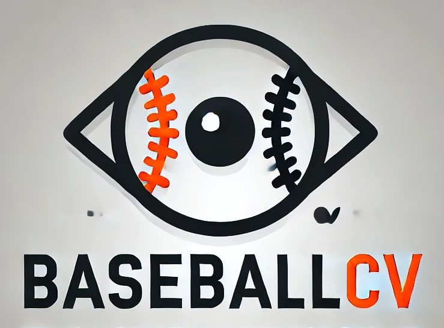
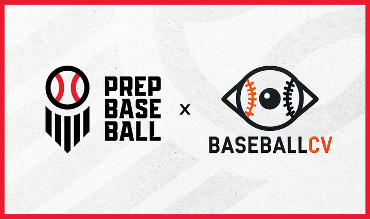

# BaseballCV

<div align="center">

[](https://github.com/dylandru/BaseballCV/actions/workflows/pytest.yml)
[](https://github.com/dylandru/BaseballCV/actions/workflows/build.yml)
[](https://codecov.io/github/dylandru/BaseballCV)


[](https://opensource.org/licenses/MIT)
[](https://www.python.org/downloads/)



**A collection of tools and models designed to aid in the use of Computer Vision in baseball.**


</div>


## 👥 Acknowledgement

<div align="center">

**Created By:** *Dylan Drummey* ([@drummeydylan](https://x.com/DrummeyDylan)) and *Carlos Marcano* ([@camarcano](https://x.com/camarcano))

**Maintained By:** *Carlos Marcano* and *Eddie Dew*

</div>


## 📋 Table of Contents
- [Goals](#-goals)
- [Installation and Setup](#-installation-and-setup)
- [Partnerships](#-partnerships)
- [Available Assets](#-available-assets)
  - [Datasets](#1-datasets)
  - [Pre-trained Models](#2-pre-trained-models)
- [Examples](#-examples)
- [Documentation](#-documentation)
- [Streamlit Applications](#-streamlit-applications)
- [Notebooks](#-notebooks)
- [Contributing](#-contributing)
- [Component Status](#-component-status)
- [License](#-license)
- [Contact](#-contact)

## 🎯 Goals

Our goal is to provide access to high-quality datasets and computer vision models for baseball. By sharing our annotated data and model weights, we hope to foster innovation in sports analytics and make it easier for developers to create tools that analyze baseball games.

## 🚀 Installation and Setup

### Clone the Repository Locally

The repository can be cloned from Github with the required dependencies installed using the following commands:

```bash
git clone https://github.com/dylandru/BaseballCV.git
cd BaseballCV
pip install poetry && poetry install
```

*Note: For managing dependencies, this package uses [poetry](https://python-poetry.org). For more information on it's use for this package, please see [Contributing](#contributing)*.

### Install Package

The package can be installed from Github with the required dependencies using the following command:

```bash
pip install baseballcv
```

### ⚠️ Important Reminders

- Imports vary from using package to using local files; every import from the package is prefixed with `baseballcv.`
- The package is currently in development and may not be fully functional. 
- While we recommend developers clone the actual repository, the package should still function well for new users.

## 🤝 Partnerships

<div align="center">

### *Prep Baseball*



We are currently in the process of partnering with **[Prep Baseball](https://www.prepbaseball.com/)** to provide open-source amateur baseball datasets and models! **Prep Baseball** believes in the power of open-source software in advancing innovation in amateur baseball, and we are excited to work with them to achieve this goal.

### *Alfredo Harp Helú*


The **[Alfredo Harp Helú Baseball Academy](https://www.academiaahh.mx/)** has graciously offered us a collection of videos from their academy to turn into Vision Datasets! They are dedicated to being one of the most technologically advanced baseball academies in Latin America, and we are excited to work with them to achieve this goal.

</div>

## 📦 Available Assets

### 1. Datasets

We provide open-source datasets containing images and corresponding annotations from baseball broadcasts and other video sources. These datasets are curated and annotated with bounding boxes and labels for various baseball objects. These datasets are designed to detect:

- Pitchers
- Hitters
- Catchers
- Baseball
- Pitcher's Glove
- Bat
- Other objects of interest

Datasets are available in common formats like YOLO, allowing for easy integration with computer vision pipelines. Our current datasets include:

<div align="center">

| Dataset Type | Format | Description |
|-------------|---------|-------------|
| **YOLO Pre-Annotated** | YOLO | Various YOLO annotations w/ photos in splits|
| **Raw Photos** | Images | Unannotated MLB broadcast and amateur baseball images |
| **COCO Format** | COCO | Comprehensive MLB broadcast annotations  |
| **Video** | MP4 | Baseball game videos |
| **Numerical** | SQL/CSV | Metrics derived from CV Models |

</div>

**Available YOLO Pre-Annotated Datasets**:
- `baseball_rubber_home_glove.txt`: A comprehensive MLB broadcast-based YOLO-format annotated dataset with annotations for baseballs, the rubber, homeplate, and the catcher's mitt.
- `baseball_rubber_home.txt`: An MLB broadcast-based YOLO-format annotated dataset with annotations for baseballs, the rubber, and the catcher's mitt.
- `baseball.txt`: An MLB broadcast-based YOLO-format annotated dataset with annotations for solely baseballs.
- `amateur_pitcher_hitter.txt`: An amateur baseball-based YOLO-format annotated dataset with annotations for pitchers and hitters.

**Available Raw Photos Datasets**: 
- `broadcast_10k_frames.txt`: A collection of 10,000 unannotated MLB broadcast images that can be used for creating custom datasets or annotations.
- `broadcast_15k_frames.txt`: A collection of 15,000 unannotated MLB broadcast images that can be used for creating custom datasets or annotations.
- `international_amateur_baseball_pitcher_photo`: A collection of 10,000 unannotated international amateur baseball pitcher photos. Photo provided by Alfredo Harp Helú Baseball Academy (accessible via [Hugging Face](https://huggingface.co/datasets/dyland222/international_amateur_pitcher_photo_dataset)).
- `international_amateur_baseball_photos`: A collection of 100,000 unannotated international amateur baseball photos. Photo provided by Alfredo Harp Helú Baseball Academy (accessible via [Hugging Face](https://huggingface.co/datasets/dyland222/international_amateur_baseball_photos_dataset)).
- `international_amateur_baseball_catcher_photos`: A collection of 15,000 unannotated international amateur baseball catcher photos. Photo provided by Alfredo Harp Helú Baseball Academy (accessible via [Hugging Face](https://huggingface.co/datasets/dyland222/international_amateur_baseball_catcher_photos_dataset)).

**Available COCO-format Datasets**:
- `baseball_rubber_home_COCO.txt`: A comprehensive MLB broadcast-based COCO-format annotated dataset with annotations for baseballs, the rubber, and homeplate.
- `baseball_rubber_home_glove_COCO.txt`: A comprehensive MLB broadcast-based COCO-format annotated dataset with annotations for baseballs, the rubber, homeplate, and the catcher's mitt.

**Available Video Datasets**:
- `international_amateur_baseball_game_video`: A collection of 205 unannotated international amateur baseball game videos. Video provided by Alfredo Harp Helú Baseball Academy (accessible via [Hugging Face](https://huggingface.co/datasets/dyland222/international_amateur_baseball_game_videos)).
- `international_amateur_baseball_bp_video`: A collection of 50 unannotated international amateur baseball Batting Practice videos. Video provided by Alfredo Harp Helú Baseball Academy (accessible via [Hugging Face](https://huggingface.co/datasets/dyland222/international_amateur_baseball_bp_videos)).
- `international_amateur_baseball_catcher_video`: A collection of 37 unannotated international amateur baseball catcher videos. Video provided by Alfredo Harp Helú Baseball Academy (accessible via [Hugging Face](https://huggingface.co/datasets/dyland222/international_amateur_baseball_catcher_video_dataset)).

**Available Numerical Datasets**:
- `mlb_glove_tracking_april_2024`: A data (in SQL and CSV format) capturing Glove Tracking Movement metrics throughout a pitch for over 100,000 plays in April 2024, generated by the BaseballTools class. 

### 2. Pre-trained Models

We offer pre-trained YOLO models for object detection. The models are trained to detect the aforementioned objects with high accuracy.

<div align="center">

| Model Type | Available Models | Use Case |
|------------|-----------------|-----------|
| **YOLO** | `bat_tracking.pt`, `ball_tracking.pt`, etc. | Object detection and tracking |
| **Florence2** | `florence_ball_tracking` | Vision-language tasks |
| **PaliGemma2** | `paligemma2_ball_tracking` | Vision-language tasks |
| **RF DETR** | `rfdetr_glove_tracking` | Improved accuracy detection |
| **YOLOv9** | `amateur_pitcher_hitter.pt` | Amateur baseball detection |

</div>

**Available YOLO Models (currently only from Ultralytics)**:
- `bat_tracking.pt`: Trained to detect bat movement from a broadcast feed
- `ball_tracking.pt`: Trained to detect the baseball from the pitcher's hand to home from a broadcast feed.
- `pitcher_hitter_catcher.pt`: Trained to detect the pitcher, hitter and catcher from a broadcast feed.
- `glove_tracking.pt`: Trained to detect and track the catcher's glove, the ball, homeplate, and the pitcher's rubber from a broadcast feed.
- `ball_trackingv4`: Trained to track ONLY the baseball from pitcher's hand to home plate.

**Available Florence2 Models**:
- `florence_ball_tracking`: Trained to track the baseball from pitcher's hand to home plate among other VLM tasks.

**Available PaliGemma2 Models**:
- `paligemma2_ball_tracking`: Trained to track the baseball from pitcher's hand to home plate among other VLM tasks.

**Available DETR Models**:
- Coming Soon...

**Available RF DETR Models**:
- `rfdetr_glove_tracking`: Trained to detect and track the catcher's glove, the ball, homeplate, and the pitcher's rubber from a broadcast feed with improved performance in accuracy.

**Available YOLOv9 Models**:
- `amateur_pitcher_hitter.pt`: Trained to detect pitchers and hitters in amateur baseball games.
- `homeplate_tracking.pt`: Trained to detect the home plate during broadcast feeds.

## 🎥 Examples

<div align="center">

### Video Detection Examples

https://github.com/user-attachments/assets/7f56df7e-2bdb-4057-a1d7-d4d50d81708e

https://github.com/user-attachments/assets/fa104a6d-ac26-460c-b096-7f20e2821c20

https://github.com/user-attachments/assets/962973c8-514b-4f39-ac02-ca9f82bf2b59

These videos showcase our models' ability to track multiple objects, including the ball, glove, and other elements in real-time.

</div>

## 📚 Documentation

### Quick Start Examples

<details>
<summary>YOLO Model Usage</summary>

```python
from baseballcv.functions import LoadTools
from ultralytics import YOLO

# Initialize LoadTools class
load_tools = LoadTools()

# Load YOLO model using alias
model_path = load_tools.load_model("ball_tracking")

# Initialize and run inference
model = YOLO(model_path)
model.predict("example_baseball_broadcast.jpg", show=True)

# Run inference on video
model.predict("assets/example_broadcast_video.mp4", show=True)

# Extract predictions
results = model.predict("assets/example_broadcast_video.mp4", show=True)
for r in results:  # loop through each frame
    for box in r.boxes.cpu().numpy():  # loop through each box in each frame
        print(f"XYXY: {box.xyxy}")  # print xyxy coordinates of the box
        print(f"XYWHN (Normalized XYWH): {box.xywh}")  # print xywh coordinates of the box
        print(f"XYXYN (Normalized XYXY): {box.xyxyn}")  # print normalized xyxy coordinates of the box
        print(f"Confidence: {box.conf}")  # print confidence of the box
        print(f"Track ID: {box.id}")  # print track id of the box (may not exist)
        print(f"Class Value: {box.cls}")  # print class value of the box
```
</details>

<details>
<summary>YOLOv9 Model Usage</summary>

```python
from baseballcv.functions import LoadTools
from baseballcv.model import YOLOv9

# Initialize LoadTools class
load_tools = LoadTools()

# Load YOLOv9 model using alias
model_path = load_tools.load_model("homeplate_tracking")

# Initialize and run inference
model = YOLOv9(model_path=model_path)
model.inference("example_baseball_broadcast.jpg")

# Run inference on video
model.inference("assets/example_broadcast_video.mp4")

# Extract predictions
results = model.inference("assets/example_broadcast_video.mp4")
for r in results['predictions']:  # loop through each prediction
    print(f"X: {r['x']}")  # print x coordinate of the box center
    print(f"Y: {r['y']}")  # print y coordinate of the box center
    print(f"Width: {r['width']}")  # print width of the box
    print(f"Height: {r['height']}")  # print height of the box
    print(f"Confidence: {r['confidence']}")  # print confidence of the box
    print(f"Class: {r['class']}")  # print class name of the box
    print(f"Class ID: {r['class_id']}")  # print class id of the box
    print(f"Detection ID: {r['detection_id']}")  # print unique detection id
```
</details>

<details>
<summary>Florence2 Model Usage</summary>

```python
from baseballcv.functions import LoadTools
from baseballcv.models import Florence2

# Initialize LoadTools class
load_tools = LoadTools()

# Load Florence2 model using alias
model_path = load_tools.load_model("florence_ball_tracking", model_type='FLORENCE2')

# Initialize and run multiple tasks
model = Florence2(model_path=model_path)

# Run object detection
detection_results = model.inference(
    image_path='baseball_game.jpg', 
    task='<OD>'
)

# Run detailed captioning
caption_results = model.inference(
    image_path='baseball_game.jpg',
    task='<DETAILED_CAPTION>'
)

# Run open vocabulary detection
specific_objects = model.inference(
    image_path='baseball_game.jpg',
    task='<OPEN_VOCABULARY_DETECTION>',
    text_input='Find the baseball, pitcher, and catcher'
)
```
</details>

<details>
<summary>RF DETR Model Usage</summary>

```python
from baseballcv.functions import LoadTools
from baseballcv.model import RFDETR

# Initialize LoadTools class
load_tools = LoadTools()

# Load RF DETR model using alias
model_path = load_tools.load_model("rfdetr_glove_tracking")

# Initialize our RF DETR model
model = RFDETR(labels=["glove", "ball", "homeplate", "rubber"], model_type="large", model_path=model_path)

# Run inference on image
model.inference("baseball_play.jpg")

# Run inference on video
model.inference("baseball_play.mp4")

# Finetune on custom dataset
model.finetune(data_path="custom_dataset.txt")
```
</details>

[View full documentation →](https://baseballcv.com)

## 🖥️ Streamlit Applications

BaseballCV provides several Streamlit-based web apps for interacting with our computer vision models and tools:

<details>
<summary>Annotation App (`/annotation_app`)</summary>

A web interface for managing and annotating baseball images/videos:
- Open-source project designed to crowdsource baseball annotations
- Upload baseball videos or photos to annotate
- Annotation interface for labeling objects and keypoints
- Integration with AWS S3 for data / photo storage
- Built-in BaseballCV models for predicted annotations

Quick start:
```bash
cd BaseballCV/streamlit/annotation_app/
docker-compose up -d
```
</details>

<details>
<summary>Gemini Annotation App (`/gemini_annotating_app`)</summary>

A Streamlit-based app for implementing automated annotation using Google AI Studio and Gemini:
- Open-source implementation of model distillation using large LLM API calls
- Use own photos for annotation
- Supports multiple CV annotation formats (YOLO and COCO)
- Generates complete dataset with uploaded photos
- Previews results with annotations shown on image
- See detailed instructions in `/gemini_annotating_app/README.md`
</details>

<details>
<summary>Inference App (`/inference_app`)</summary>

A Streamlit-based app for implementing inference models on baseball video or image feed:
- Designed to eliminate using code to make inferences
- Ability to download annotated inferences
- Supports multiple model types (YOLO, YOLOv9, RF DETR)
- See detailed instructions in `/inference_app/README.md`
</details>

## 📓 Notebooks

Along with our datasets and models, we have provided several notebooks to help you get started with our repo. These are designed to help you understand the application of our models to real-world baseball videos, which are all accessible in the `notebooks` folder:

<details>
<summary>Core Model Notebooks</summary>

- `ball_inference_YOLOv9.ipynb`: Demonstrates ball tracking using YOLOv9
- `Glove_tracking.ipynb`: Shows how to use the glove tracking model and extract predictions
- `YOLO_PHC_detection_extraction.ipynb`: Demonstrates pitcher, hitter, catcher detection and prediction extraction
- `glove_framing_tracking.ipynb`: Demonstrates how to extract glove tracking coordinates and transpose them to a 2D plane
</details>

<details>
<summary>Advanced Model Notebooks</summary>

- `model_fine_tuning.ipynb`: Shows how to auto fine-tune our models using the glove tracking model as an example
- `Florence_2_example.ipynb`: Shows how to use the Florence2 class for custom training
- `PaliGemma2_demo.ipynb`: Demonstrates using PaliGemma2 for computer vision tasks
- `DETR_example.ipynb`: Shows baseball detection using DETR (Detection Transformer) model
- `rfdetr_glove_tracking.ipynb`: Demonstrates using RF DETR for improved glove tracking accuracy with recurrent feature refinement
</details>

<details>
<summary>Analysis and Tools Notebooks</summary>

- `CommandAnalyzer.ipynb`: Demonstrates command analysis tools
- `using_dtz_tool.ipynb`: Shows how to use the DTZ (Distance to Zone) tool
- `POC_Distance_to_SZ.ipynb`: Proof of concept for distance to strike zone analysis
- `intended_target_example.ipynb`: Demonstrates intended target analysis
- `okd_nokd_classifier.ipynb`: Creates a model to detect One Knee Down position
- `autolabeling_semisupervised.ipynb`: Demonstrates how to use the `DataTools` class for auto-annotating images
</details>

### Future Streamlit Apps Available Soon

These videos showcase our models' ability to track multiple objects, including the ball, glove, and other elements in real-time.

## 🤝 Contributing

We welcome contributions from the community! Whether you're looking to improve our datasets, train better models, or build new tools on top of our work, feel free to open a pull request or start a discussion.

### How to Contribute (for repository maintainers)

If you are interested in helping maintain or add to the repository, please follow these steps:

1. Fork the repository
2. Create a new branch (git checkout -b feature/YourFeature)
3. Commit your changes (git commit -m 'Add YourFeature')
4. Push to the branch (git push origin feature/YourFeature)
5. Open a pull request

#### Dependency Managing
This repository uses poetry for more intuitive management of package installation. Here's how to get it set up in your environment:

```bash
pip install poetry==2.1.2
```

Once poetry is installed, it's recommended to use a virtual environment to prevent dependency conflicts. Here's how you can do it with poetry:

```bash
poetry config virtualenvs.in-project true
poetry install  # If you are contributing to a streamlit app or unit tests, add the `--with dev` flag
source .venv/bin/activate
```

This creates a virtual environment in your project directory and the dependencies required to operate the package. If you are adding new dependencies, simply write:

```bash
poetry add ____  # library name
```

The dependency is automatically updated, so you don't have to worry about adding it manually to a `requirements.txt` file. 
If you want a specific python version:

```bash
poetry env use ___  # python version
poetry run python --version
```

### How to Contribute (for supporters)

Our main need is for data annotation. With our new annotation app, you can help us annotate certain datasets. To do so, please follow these steps:

1. Go to the App: [Annotation App](https://balldatalab.com/streamlit/baseballcv_annotation_app/)
2. Enter a Username and Email
3. Open Existing Project
4. Select a Dataset (as of right now, we need with `player_detection`)
5. Open the Annotation Interface and begin annotating!

## 📊 Component Status

<div align="center">

[](https://codecov.io/gh/dylandru/BaseballCV)
[](https://codecov.io/gh/dylandru/BaseballCV)
[](https://codecov.io/gh/dylandru/BaseballCV)
[](https://codecov.io/gh/dylandru/BaseballCV)

[](https://codecov.io/gh/dylandru/BaseballCV)

</div>

## 📄 License


This project is licensed under the MIT License - see the LICENSE file for details. **Note: Please double check the folder for any additional licenses.**

### Important Licensing Clarification for Major League Baseball (MLB) Entities

1.  **For MLB Teams:**
    The use, modification, deployment, or distribution of this software (or any derivative works based upon it) directly by, or for the operational, analytical, or developmental purposes of, a **Major League Baseball (MLB) team** (including its directly owned and operated affiliates) is subject to the terms of the GNU Affero General Public License v3.0 (AGPLv3). A copy of the AGPLv3 is included in this repository as `LICENSE-MLB-AGPL.txt` for review.

    MLB **teams** (or entities acting directly on a team's behalf for such purposes) intending to use this software under these conditions must contact Dylan Drummey or Carlos Marcano at the contact information below to ensure understanding and compliance with the AGPLv3 terms.

2.  **Exclusion for MLB Contractors and League Employees (acting in individual or general league capacities):**
    To clarify, the specific AGPLv3 licensing requirement mentioned above for MLB **teams** **does not** apply to individuals who are MLB contractors / MLB league employees when they are using this software for their own individual projects, personal education, or for general league operational tasks not specific to the competitive baseball operations of a particular MLB team. In such cases, these individuals are covered by the MIT License.

3.  **Overriding Principle for Team Use:**
    Notwithstanding the above, if any software derived from this project is ultimately used, deployed by, or operated for the direct benefit and under the control of an **MLB team** for its team-specific purposes, that **team's** use and distribution of such software (regardless of who performed the modifications) falls under the AGPLv3 obligations.

4. **Failure to adhere to these terms may result in license revocation.**

## 📞 Contact

<div align="center">

**Dylan Drummey** 

[](https://x.com/DrummeyDylan) [](mailto:dylandrummey22@gmail.com)    
dylandrummey22@gmail.com

**Carlos Marcano**  

[](https://x.com/camarcano) [](mailto:c.marcano@balldatalab.com)   
c.marcano@balldatalab.com

**Eddie Dew**

[](https://x.com/da_mountain_dew) [](mailto:edew4502@gmail.com)  
edew4502@gmail.com

</div>
